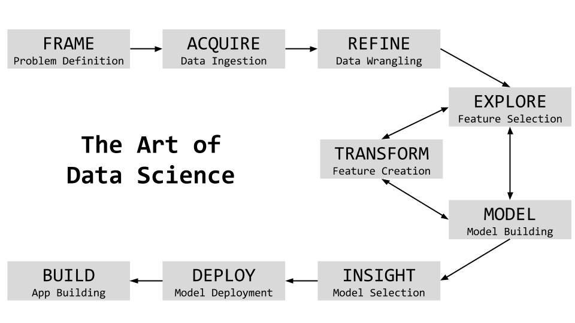

# Build and Deploy Machine Learning Models on the Cloud

**Motivation for the Session**

- Solve a business problem
- Understand the end-to-end approach
- Build a data-driven Machine Learning application on the cloud

**Our approach** is to take a case-driven example to showcase this. And we will aim to go-wide vs. go-deep to do so. The approach will be both practical and scalable. Lets start by understanding the overall steps involved in building a data-driven application.

### Art of Data Science Process

This session/workshop delves deep into the process and how this can be used to solve the problem end-to-end.

### About the speakers

Amit Kapoor teaches the craft of telling visual stories with data. He conducts workshops and trainings on Data Science in Python and R, as well as on Data Visualisation topics. His background is in strategy consulting having worked with AT Kearney in India, then with Booz & Company in Europe and more recently for startups in Bangalore. He did his B.Tech in Mechanical Engineering from IIT, Delhi and PGDM (MBA) from IIM, Ahmedabad. You can find more about him at [amitkaps.com](http://amitkaps.com) and tweet him at [@amitkaps](https://twitter.com/amitkaps).

Bargava Subramanian is a Data Scientist with 14 years experience in delivering business analytics solutions to Investment Banks, Entertainment Studios and High-Tech companies. He has conducted numerous workshops and given talks on Data Science, Machine Learning, Deep Learning and Optimisation in Python and R in India and abroad. He has a Masters in Statistics from University of Maryland, College Park, USA. He is an ardent NBA fan and you can know more about him at [bargava.com](http://bargava.com) and tweet him at [@bargava](https://twitter.com/bargava).

### Instructions to build and deploy on Digital Ocean

1. Login to [DigitalOcean](https://www.digitalocean.com/)  
2. Create Droplet  
3. Click on **one-click apps** and select **Machine Learning and AI**  
4. Choose size (2GB/2CPU is a good start)  
5. Choose a data center region  
6. Add SSH keys  
7. Give name to the host and click create  

Give it a few seconds and the droplet will up. Copy the IP address of the droplet

Now, come to the terminal and type the following command

    $ ssh science@public-ip-of-droplet

Here, copy the link to jupyter notebook provided in the welcome message. This is what we need to login to the jupyter notebook on Digital Ocean.

But before we get there, we need the repository - that has the data and code that we want to run on cloud.

Clone the repository

    $ git clone https://github.com/amitkaps/datascience.git

The first step is to create a virtual environment. It is always a good practice to create a separate environment for the project.

    $ cd datascience
    $ virtualenv mlcloud   # mlcloud is the name of the virtual environment

    $ source mlcloud/bin/activate    # activate the virtual environment

Now, the required libraries need to be installed. The libraries needed for the session are listed at requirements.txt.

    $ pip install -r requirements.txt

Now, the virtual environment needs to be activated for `Jupyter Notebook`

    $ python -m ipykernel install --user --name=mlcloud

We are all set. Now, open the jupyter notebook by entering the URL provided in the welcome message, in the browser

